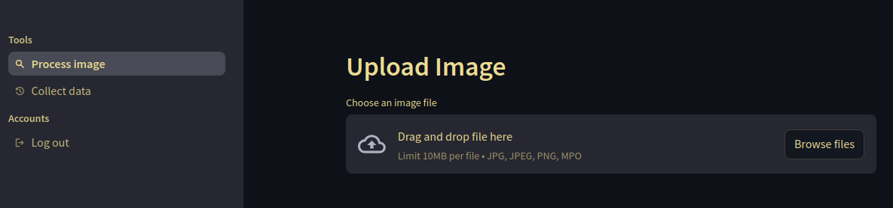
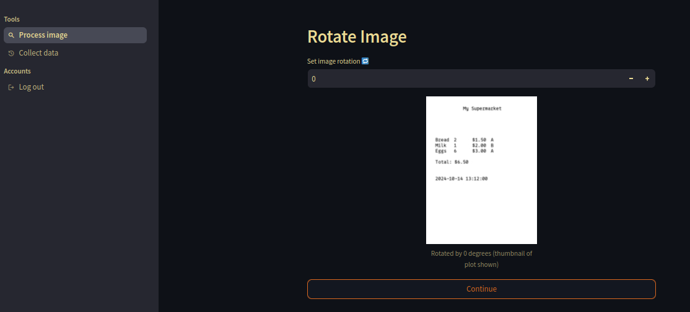

# Groceries parser app

> App to extract groceries data from images using streamlit and instructor.

## Purpose

If you have a receipt like


you can use this repo to get the data from that image into a pydantic validated form. The resulting JSON may look something like

```json
{
    "shop": {
        "name": "My Supermarket",
        "date_str": "2024-10-14",
        "time_str": "13:12:00",
        "total": 6.5
    },
    "items": [
        {
            "name": "Bread",
            "price": 1.5,
            "count": 2,
            "mass": null,
            "tax": "A",
            "category": "Bread and baked goods"
        },
        {
            "name": "Milk",
            "price": 2.0,
            "count": 1,
            "mass": null,
            "tax": "B",
            "category": "Dairy"
        },
        {
            "name": "Eggs",
            "price": 3.0,
            "count": 6,
            "mass": null,
            "tax": "A",
            "category": "Dairy"
        }
    ]
}
```

either running it locally or on railway. The latter allows you to take a picture on your phone, upload it and later collect the results on another machine, e.g. your desktop and do the post-processing of your groceries data you have always dreamed of.

Note: The pieces for the receipt image generation can be found in the jupyter notebook `./synthesize-and-parse-receipt.ipynb`.

What does the app look like you ask? :-)

## App screens

### Login


### Upload




### Rotation



### Cropping


### Extraction & Wrangling


### Collection


### Logout


Alright, interested in deploying the app? :-)

## Deployment

The following sketches three deployment Options

1. run locally
2. run locally in a docker container
3. run remotely on railway

To deploy first run

    git clone https://github.com/eschmidt42/streamlit-railway-groceries-receipt-app
    cd streamlit-railway-groceries-receipt-app

### 1. Run locally

This project is managed with rye. So first install rye: https://rye.astral.sh/guide/installation/ and then run

    rye sync --no-dev

to install required dependencies for running the app only. If you want to also develop run

    rye sync
    playwright install-deps
    playwright install


To run the streamlit app the following setup is needed

    cp app-config-template-local.toml app-config.toml
    mkdir -p ./data/og/extraction-artifacts ./data/og/collation-artifacts ./keys
    echo "You'll guard me and you'll guide me" > ./keys/dummy

The `app-config.toml` tells your streamlit app where to store data and how to configure the anthropic client. So you'll want to get your anthropic key ([docs to the rescue](https://docs.anthropic.com/en/docs/)) and put it into a file in `./keys`, it may or may not be called `dummy` :-) (if not make sure to update `key_file_name` in the toml).

Now it's time to start the streamlit app using

    rye run streamlit run app/main.py

and open `localhost:8501` to marvel at it. Such startling levels of twig technology!

To log in, the app will check against `user.db`, a sqlite database. You can create it using

    rye run python create-user-db.py

This will ask you to choose a password for the user `og`.

Now you should be good to go! Go forth and log in.

### 2. Run locally in a docker container

The `Dockerfile` here is set up to perform a two-stage build. You can start it using

    docker build --tag demo-groceries-parser-app-railway -f Dockerfile .

and run the container using

    docker run -p 5000:5000 -e KEY=$SERVICES__ANTHROPIC__KEY -e PORT=5000 demo-groceries-parser-app-railway:latest

Now you should be able to log into your locally run app at `localhost:5000`.

The `$SERVICES__ANTHROPIC__KEY` assumes you have that environmental variable. If you want you can instead paste your key of course.

OOOOOORRR you may specify that using `.envrc` using [direnv](https://direnv.net/). If that's the case run

    cp .envrc-template .envrc

replace `YOURKEY` in `.envrc` with erm ... your key

    direnv allow .

and then the docker run command again :-).


### 3. Run remotely on railway

If you want to run this app o

Railway provides a cli tool that we'll use here. The install docs: https://docs.railway.app/guides/cli

Once the cli is installed let's login with

    railway login

enter an e-mail address, copy the code you get, open the one you receive from railway and copy the code to the page linked in the e-mail. Then create a new project by clicking the "+" button in the top right and then "empty service".

Then create a token as described in the docs: https://docs.railway.app/guides/public-api#creating-a-token

In the project click "Settings", a tab in the top right, then "Tokens", then enter a name for your project token, then click "create.

Optionally update `RAILWAY_TOKEN` in `.envrc` as , e.g.

    echo "RAILWAY_TOKEN=yourtoken" >> .envrc
    direnv allow .

Now let's initiate the railway project, e.g. using

    railway init -n demo-app

Now we are ready to deploy with

    railway up

`railway.toml` specifies that we want to deploy `./Dockerfile`.

To switch to the canvas in the browser use

    railway open

If you don't want to use `.envrc` run the above commands like

    RAILWAY_TOKEN=YOURTOKEN railway up

In order to attach a postgres db to your railway service for user authentication click "Create > Database > Add PostgreSQL" in the top right of the canvas.

Then click on the added tile representing the database. Then click "Data > Create Table" and create a table called `app_users` with the column `username` and `hashed_password`, each of type `text`. Look at the `hashed_password` property of the `User` dataclass in `create-user-db.py` for how to create a hashed password. Then click the table and add rows for your users. Note that the usernames have to be present in your Dockerfile in the layer that created user specific directories, as `og` in `/data/og/extraction-artifacts` in the current Dockerfile.

Now let's tell railway to connect the streamlit app we pushed and the postgres app we created in the gui.

The fastest way (if available) is to click the stremalit app tile and then the `Variables` tab. There at "Looking to connect a database?" Click `Variable reference` and add `DATABASE_URL` from the postgres app.

If that does not work the manual route is to click on the `Variables` tab of the database tile and copy the `DATABASE_URL` value and paste it as `DATABASE_URL` in the `Variables` tab in your streamlit app tile.

Lastly, let's set the variables `KEY` and `PORT` in the `Variables` tab in the streamlit app tile. `KEY` should contain your valid anthropic key and `PORT` should be `5000`.

Once the variables are updated a "Deploy" button should pop up in the top left asking to apply those changes. If this ran successfully you should be able to toy with your app in your browser in "local" mode.

If you want to make the app generally available, e.g. to take pictures of receipts with your phone and submit them to processing to collect the for analysis on your desktop machine, click the streamlit app tile and then `Settings` and choose a name under "Networking > Public Networking".

Note: If you want to take your railway app offline, you currently have to delete its deployment via

    railway down

or in the `Deployments` tab of the streamlit app tile and then clicking the vertical three dots button of the current deployment and then clicking the "Remove" button.
